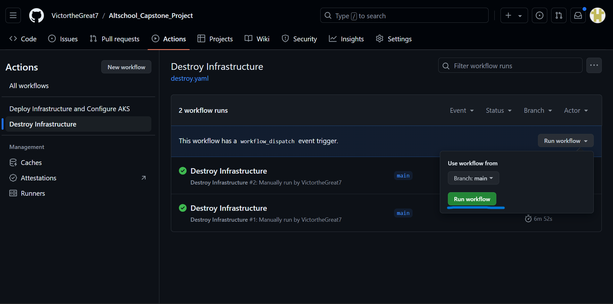

# Deploy a Microservices Application on Azure Kubernetes Service using GitHub Actions

In this project, you will deploy a microservices application on an Azure Kubernetes Cluster. You will use GitHub Actions to automate provisioning an Azure Cloud infrastructure (mainly Azure Kubernetes Service) with Terraform and configure it to host the application using Ansible (which will use kubectl to deploy the provided manifests).

In this repository, you have the Terraform, Bash and Ansible scripts you will need to bring the application to life and set up basic alerting, monitoring and logging.

## Pre-requisites

- An [Azure Account](https://azure.microsoft.com/en-us/pricing/purchase-options/azure-account?icid=azurefreeaccount) (preferably with an Entra ID User Account with a Subscription Owner and Entra ID Global Administrator roles assigned to it. Also, some of the services you will use are not free. The account needs to be funded)
- A Domain Provider (e.g. [Name.com](https://www.name.com/), [Namecheap](https://www.namecheap.com/), etc)
- A [GitHub](https://github.com/) Account
- An Ubuntu Machine (There are bash scripts, in this project, that need to be run. Sudo privileges are also important). If you do not have an Ubuntu Machine, you can use a Virtual Ubuntu Machine. Windows Subsystem for Linux (WSL) is also fine (make sure to use the Ubuntu distribution). Just make sure all the needed tools here are not being borrowed from your Windows environment (for instance, Azure CLI and kubectl installed on your windows machine can be used on WSL too). You have to install them in the WSL environment specifically to avoid conflicts.
- [Git](https://git-scm.com/download/linux) installed on your machine
- [Azure CLI](https://learn.microsoft.com/en-us/cli/azure/install-azure-cli-linux?pivots=apt) installed on your machine
- [kubectl CLI](https://kubernetes.io/docs/tasks/tools/install-kubectl-linux/) installed on your machine
- [kubelogin CLI](https://azure.github.io/kubelogin/install.html) installed on your machine. I recommend that you use Azure CLI to install it
- [jq](https://jqlang.github.io/jq/download/) (a commandline JSON processor) installed on your machine (`service_principal.sh` will try to install it if you don't have it)
- [curl](https://curl.se/) command installed on your Ubuntu (`authorized_ips.sh` will try to install it if you don't have it)
- Ansible and Ansible Vault installed on your machine

## Instructions

1. **Fork the Repository**:
    Fork this repository to your own account. If you do not want to have to do much editing of some files, you should leave the repository name as is.

2. **Clone the forked repository to your Ubuntu machine**:
    Using the `git clone` command in your terminal, clone the forked repository to your local Ubuntu machine.

3. **Login to Azure CLI as your Azure Entra ID User**:
    Log in to Azure CLI in your Ubuntu/Bash terminal. Make sure it is a user that has all the roles and specifications listed in the pre-requisites. Check [user_roles.md](screenshots/user_roles.md) for the roles you need to make sure you have.

4. **Run the `service_principal.sh` bash script**
    Change your working directory to the root of the cloned repository in your bash terminal. Open the [service_principal.sh](service_principal.sh) bash script in you editor and change the `GITHUB_NAME` variable value to the name of your Github Account. Make sure the script is executable (you can run `chmod +x service_principal.sh` to make it executable), then run it (type in `./service_principal.sh` in your terminal to run it). This will create a service principal user for GitHub Actions to use during its workflow and save the needed details in the [secrets.yaml](secrets.yaml) file which we will encrypt later. It also saves the current Azure user's object ID (which is part of what will be used to give your own machine access to the cluster's API Server when GitHub Actions is done with the deploy job) to the [terraform.tfvars](capstone_terraform/terraform.tfvars) file.

5. **Assign the Group Administrator role to the newly created Service Principal**:
    Go to your Azure Account on the Azure Portal and type in the search bar "Entra Roles". If you see Microsoft Entra Roles and Administrators, click on it. That is where you assign the Service Principal the "Group Administrator" role. Terraform will need the Service Principal user, that GitHub Actions job runner is logged in as, to have that role to be able to create a group as specified in the [permissions.tf](capstone_terraform/permissions.tf) file. Check out [group_role_admin.md](screenshots/group_admin_role.md) for visual instructions on how to create the role.

6. **Create secrets for GitHub Actions**:
    The [secrets.yaml](secrets.yaml) file, that has been populated with the newly created Azure Service Principal user details by [service_principal.sh](service_principal.sh) bash script in Step 4, is meant for the Ansible script that GitHub Actions will run in its workflow but some of the details inside are needed by the workflow scripts themselves to have successful runs. You will need to create some secrets in the GitHub settings of your forked repository. Check out [github_secrets.md](screenshots/github_secrets.md) for visual examples of how to do so. The [secrets.yaml](secrets.yaml) file has most of the values you need for the secrets you will set for GitHub Actions.

7. **Encrypt the secrets.yaml file with Ansible Vault**:
    The details in secrets.yaml are sensitive, so you'll need to encrypt them before pushing it to the GitHub repository. Run `ansible-vault encrypt secrets.yaml` to encrypt the file. You will be prompted to enter a new password in the terminal. Set it to be the password you have saved for `ANSIBLE_VAULT_PASSWORD` in your GitHub Actions secrets in the previous step. `ansible-vault decrypt secrets.yaml` command decrypts the file (in case you were not done with Step 5).

8. **Run the `authorized_ips.sh` script**:
    Change your working directory to the `capstone_terraform` directory in your bash terminal, make sure [authorized_ips.sh](capstone_terraform/authorized_ips.sh) file is executable (like you did for the [service_principal.sh](service_principal.sh) bash script) and run it like so: `./authorized_ips.sh`. This script ensures that access to the cluster and its services, except the frontend, is restricted (including viewing them in the browser with their assigned subdomain names) to only your current IP address. It does that by editing the [ingress.yaml](microservices_manifests/ingress.yaml) file and the [terraform.tfvars](capstone_terraform/terraform.tfvars) file. You only need to run it once. If you run it more times than that, you'll have to manually reduce the IP addresses it added to those files mentioned to just have the latest one.

9. **Edit Ingress Manifest to use your Domain Name**:
    In the [ingress.yaml](microservices_manifests/ingress.yaml) file, edit every instance of `<subdomain>.mywonder.works` to use your own domain name. For instance, if you see `kibana.mywonder.works` edit it to `kibana.yourdomain.com`.

    

    If you don't place your domain name in that manifest file and configure your domain's DNS settings as specified in step 11, you will not be able to see your application in the browser except you use the `kubectl port-forward` command. If you try to use the external IP (that the Azure Loadbalancer, configured when [ingress.yaml](microservices_manifests/ingress.yaml) is applied by [clusterconfig_playbook.yaml](clusterconfig_playbook.yaml) Ansible script in the GitHub Actions workflow, will give you) in the browser, you will only get an error page.

10. **Push to your GitHub Repository**:
    After following the previous steps correctly, uncomment the part of the [build.yaml](.github/workflows/build.yaml) script that triggers GitHub Actions (where I marked in green) to run the script on git push, then comment out (where I marked in red) the manual trigger part.

    

    Using `git` command in your terminal, add and commit the changes you have made, then push the repository to your GitHub Repository. GitHub Actions, following the instructions specified by the build script, will automatically build and deploy the application. Select the running workflow in the Actions section of your repository to view its progress.

11. **Configure Domain Name DNS Settings**:
    In your domain provider's website, there should be a way to configure DNS settings for your domain. [clusterconfig_playbook.yaml](clusterconfig_playbook.yaml) Ansible script should output an External IP in the workflow like so.

    

    But if after GitHub Actions has run the deploy job successfully, you do not see that output, you will need to connect to the cluster on your local Ubuntu machine and check for it your self. To do that, go to the Azure Portal and look for a cluster named `capstone_cluster` in a resource group called `altschool-capstone-rg`, in the Overview dashboard of that cluster look for a `Connect` option. You will find the `az aks get-credentials` and `kubelogin` commands listed there. Run the `az aks get-credentials` command first, then the `kubelogin` command, on your bash terminal. If the first service_principal.sh script you ran earlier worked fine, you should be able to get access to the cluster. After you have successfully gotten access to the cluster you can run `kubectl get ingress` and get the LoadBalancer External IP you need. If the command runs successfully, copy the IP address you see under EXTERNAL IP and use it to configure A records for each subdomain. [my_subdomain_config.md](screenshots/my_subdomain_config.md) has screenshots of how I set A records for each subdomain specified in the [ingress.yaml](microservices_manifests/ingress.yaml) manifest.

12. **View you Application from any Browser on any Device**:
    The certificate issuer in the cluster usually needs a while to do its work. If you type in the URLs set in the [ingress.yaml](microservices_manifests/ingress.yaml) manifest and configured in the DNS A records of your domain name, in the browser, you may get an error that the connection is not secure. After a while, the certificates should have been issued and the URLs will work fine. Check your Sock Shop aplication first (sockshop.yourdomain.com), then you can check the others.

    All the URLs should be:
    - sockshop.yourdomain.com
    - prometheus.yourdomain.com
    - grafana.yourdomain.com
    - alertmanager.yourdomain.com
    - kibana.yourdomain.com

    Note: Only the application's frontend (sockshop.yourdomain.com) is available to any IP requesting it. The URLs for the of the alerting, monitoring and logging services (just like access to the cluster's API Server) will only be accessible to the IP address that [authorized_ips.sh](capstone_terraform/authorized_ips.sh) bash script whitelisted in [ingress.yaml](microservices_manifests/ingress.yaml) when you ran it in Step 8.

13. **Test Prometheus Alerts**:
    With access to the cluster's API server (Check Step 11 for how to get that access), in your Ubuntu terminal, with `microservices_manifests` as your working directory, run `kubectl apply -f loadtest-dep.yaml` to test Prometheus Alerts. Check to see if the pods in the `load-test` namespace are running with `kubectl get pods -n load-test`. After a while, if you go to the alerts section in the Prometheus service UI (prometheus.yourdomain.com), there is a rule already set. The deployed load test pods will trigger that alert after running for some minutes. Just keep refreshing the Alerts section of the Prometheus UI. The alert from being inactive, will move to pending and then will start firing. Check out online on how to send those alerts to a place you can get a webhook, like Slack. Since you have Cluster API Server access, you can test other alerts and how to get them as messages on Slack.

14. **Test Grafana Dashboards**:
    Type in the Grafana service URL (grafana.yourdomain.com) in the browser. You can login using `admin` as the value for username and password. You will be given a skippable option to create a new one. Once logged in, navigate to Data Sources in the Setting bar on the left pane and click on add data source. Choose Prometheus as the source and put in `http://prometheus.monitoring.svc.cluster.local:9090` in the space for URL. In the Dashboard section, click on Import for all the dashboards you see. Then Click on save and test in the previous section where you added in the prometheus svc URL. Go to the Folder's section in the Search icon on the left pane. You will see the dashboards you imported earlier. Click on them to view them.

15. **Destroy the Infrastructure**:
     When you are done testing, you can destroy the infrastructure by manually running the destroy workflow in the GitHub Actions section of your GitHub repository.

     

     When you select the `Destroy Infrastructure` workflow, Github Actions will destroy the cloud infrastructure built earlier. Select the running workflow to view progress.

     
     

# Architecture Diagrams

## Build workflow Diagram

## Destroy workflow diagram

## Diagram of Infrastructure to be built by Terraform

