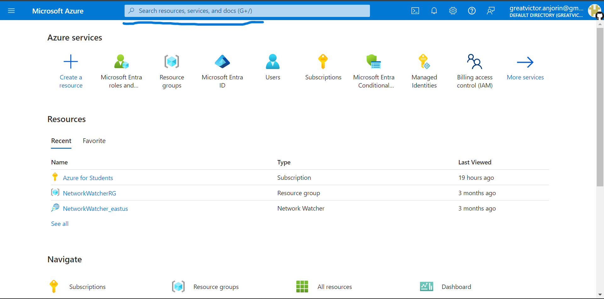
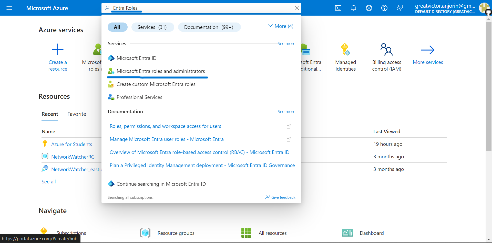
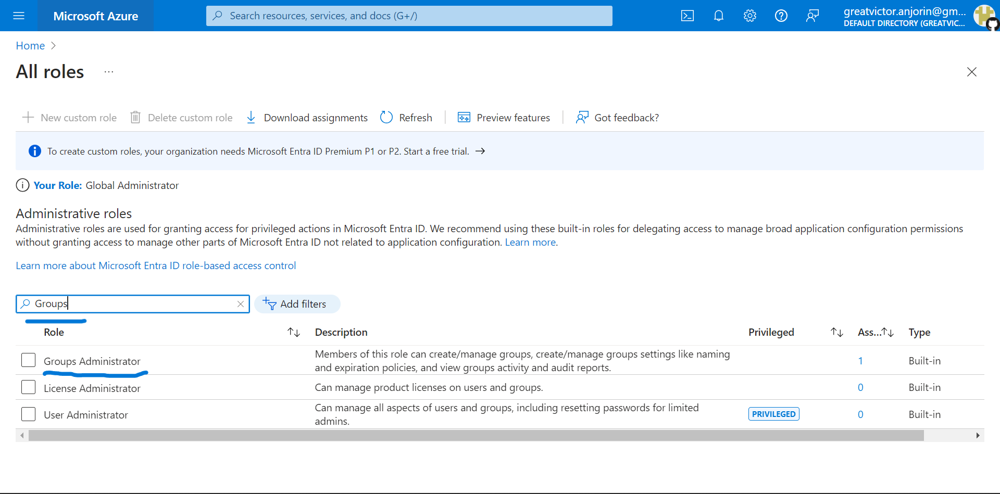
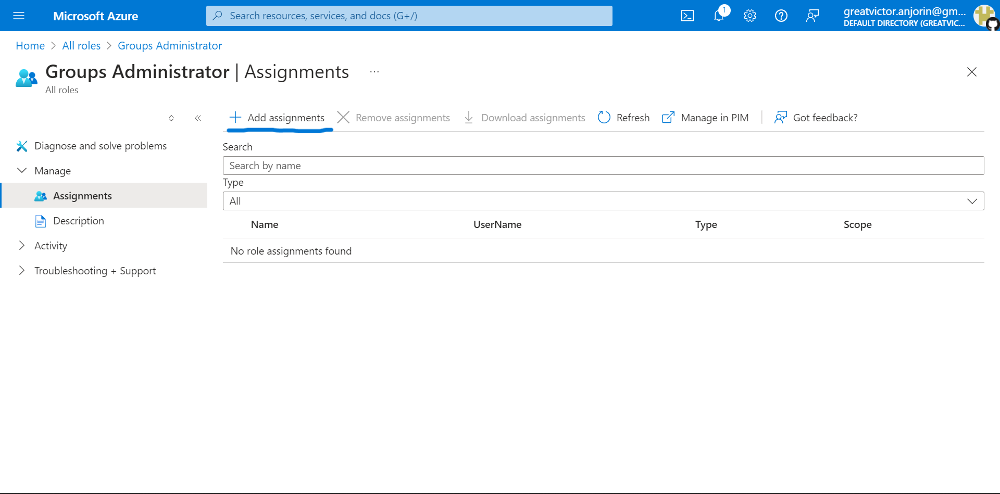
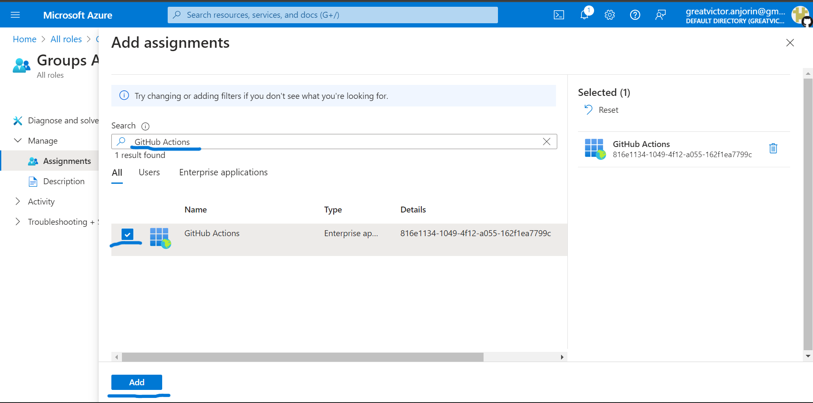
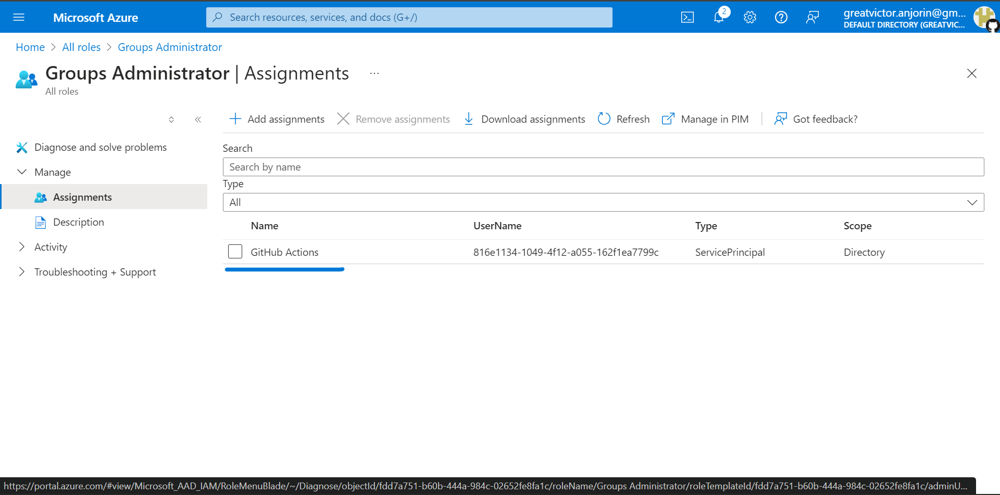

# How to assign Groups Administrator Role

1. **In the Azure Portal, search for Entra Roles**

2. **Click on Microsoft Entra Roles and Administrators**

3. **Search for Groups Administrator and click on it**

4. **Click on Add Assignment**

5. **Search for your newly created Service Principal called capstone_service_principal (except you changed the name or did not run the [service_principal.sh](../service_principal.sh) bash script properly, you should see it). Select it and add it (Ignore that it is called GitHub Actions here. You are looking for capstone_service_principal).**

6. **It should show up like this when you have added it. You can move on to the next step.**

