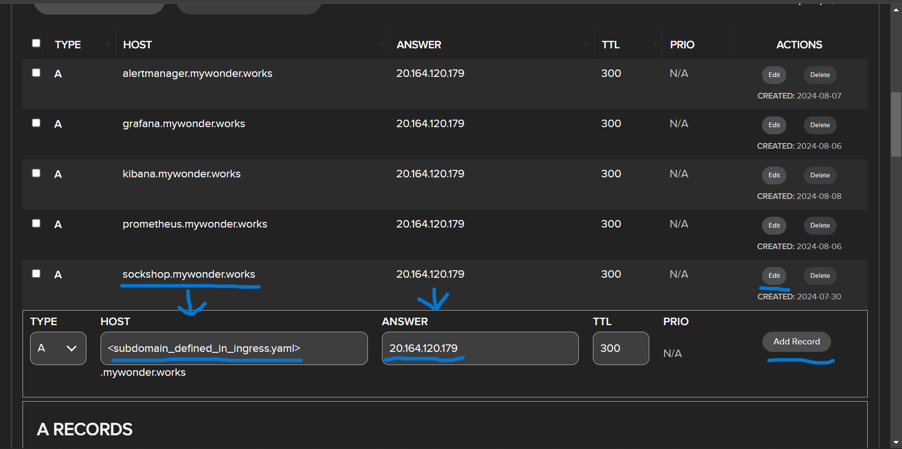

# How I configured A records for the subdomains

- **I used [Name.com](https://www.name.com/) as my domain provider and this is how I set up the subdomains. Each one is using the same External IP ([ingress.yaml](microservices_manifests/ingress.yaml) handles the routing to each service). Depending on which domain provider you use, just put in the subdomain (e.g. sockshop), and the IP. Then save it. It may take a while to propagate. For me, it usually took around 10 minutes for the DNS records to propagate.**

